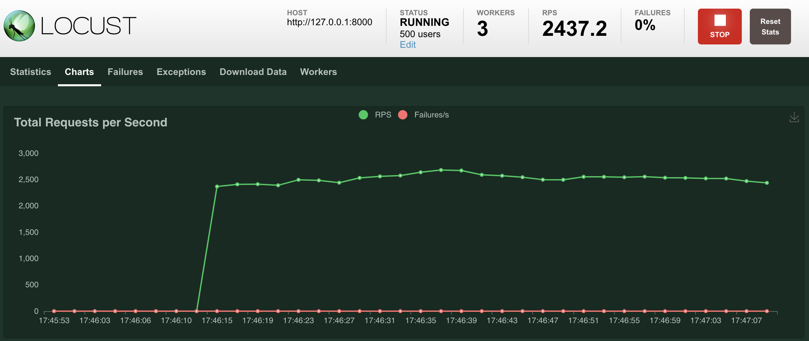
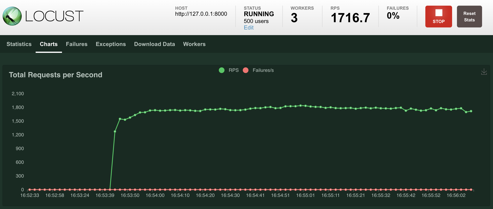

# ASGI Server Performance

Comparing the performance of various ASGI servers.

## Setup

Install the requirements:

```bash
pip install -r requirements.txt
```

Start one of the ASGI servers, using the named shell script. For example:

```bash
# Increase the max number of files which can be open:
ulimit -Sn 10000

# Start the server:
./daphne.sh
```

Start Locust, and three workers, each in a separate terminal tab.

```bash
# tab 1
locust --master

# tab 2
locust --worker

# tab 3
locust --worker

# tab 4
locust --worker
```

Open `http://0.0.0.0:8089/` in a browser to see the Locust GUI. Start a new test.


### Number of Locust workers

The test was run using a 2.7 GHz Core i7 (9th Gen) processor with 6 cores, and 16 GB RAM. Your mileage may vary - make sure there are enough workers that none of them hit 100% CPU usage, as it will give misleading results.

You can see the CPU usage of each worker in the workers tab of the Locust GUI.


### Server configuration

To get fair results, logging was disabled for each server.

-----
## Results

Uvicorn has the largest throughtput, and Hypercorn and Daphne were basically equal.

### Uvicorn



### Hypercorn


### Daphne



-----

## Conclusions

If performance is your main aim, then Uvicorn is a good starting point. However, all of the servers performed well, so all are good choices.
